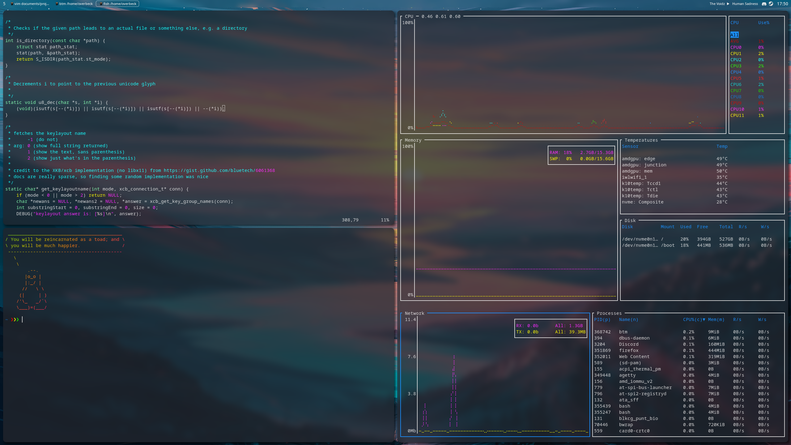

# config

- Intended for an Arch Linux desktop
- Includes important configuration for my most heavily customised software.
- Do whatever you want with this.

Contact me for similar configurations for a laptop.
